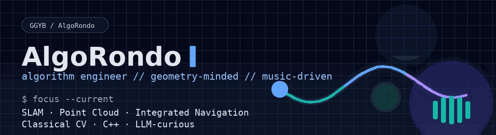

<div align="center">
  
  <p>
    
    
    
    
    
  </p>
</div>

```bash
algo@rondo:~$ whoami
Algorithm Engineer @ RTK industry

algo@rondo:~$ bias
robustness > hype && accuracy > decoration

algo@rondo:~$ side-channel
Music
```

<div align="center">
  <h3>Contribution Pulse</h3>
  <a href="https://github.com/GGYB">
    <picture>
      <source
        media="(prefers-color-scheme: dark)"
        srcset="./assets/contribution-snake-dark.svg"
      />
      <source
        media="(prefers-color-scheme: light), (prefers-color-scheme: no-preference)"
        srcset="./assets/contribution-snake.svg"
      />
      
    </picture>
  </a>
</div>

## Signal / 信号

I build algorithms that are supposed to keep working after the demo ends.
My day job lives in the RTK world: `SLAM`, `point cloud processing`, `integrated navigation`, and a lot of `C++`.
Lately, a growing part of my attention has shifted toward `LLM` systems and the engineering patterns around them.

我做的不是只在演示里好看的算法，而是要在真实环境里继续工作的算法。
我的主要工作在 RTK 相关场景里，核心方向是 `SLAM`、`点云处理`、`组合导航`，以及大量基于 `C++` 的算法实现。
最近我也越来越关注 `LLM` 系统，以及它背后的工程方法和系统设计。

## Why `AlgoRondo` / 为什么叫 `AlgoRondo`

`AlgoRondo` comes from two things I like: `algorithms` and `music`.
A rondo returns to a theme, but never in exactly the same way twice.
That feels familiar: structure, recurrence, variation, timing.

`AlgoRondo` 这个名字来自我喜欢的两样东西：`算法` 和 `音乐`。
Rondo 是一种不断回到主题、但每次又带着变化的结构。
这和工程很像：结构、重复、变化、节奏。

## Core Domains / 技术坐标

| Domain | Notes |
| --- | --- |
| `C++` | My default language for algorithm work |
| `LiDAR SLAM` | Geometry-heavy systems, estimation, mapping, robustness |
| `Point Cloud` | Processing, representation, filtering, and spatial reasoning |
| `Integrated Navigation` | Multi-source fusion, system behavior, stability |
| `Classical CV` | Traditional computer vision methods are still part of my toolbox |
| `LLM` | Current curiosity and likely next growth vector |

## Bias / 工作偏好

- `robustness > hype`
- `accuracy > decoration`
- `explainability > mystery`
- `systems that survive noise, drift, and messy data`

- `鲁棒性` 比热闹更重要
- `准确性` 比表面效果更重要
- `可解释性` 比神秘感更重要
- 我更相信那些能扛住噪声、漂移和脏数据的系统

## Offstage / 幕后

Most of the substantial engineering work I do lives in private company repositories, so I cannot show those projects directly here.
This profile is not a public dump of everything I have built.
It is a compact map of what I work on, how I think, and where I may be heading next.

我很多核心工程工作都在公司的私有仓库里，因此没法直接把项目公开展示在这里。
所以这个主页不是一个“全部作品公开陈列区”。
它更像是一张压缩过的技术地图，说明我在做什么、怎么思考，以及接下来可能走向哪里。

## Current Vector / 当前向量

- Still grounded in geometry-driven systems
- Looking more seriously at `LLM` applications and evaluation
- Curious about where robotics pipelines and foundation models may eventually meet
- Usually thinking with music on

- 仍然扎根在以几何和估计为核心的系统里
- 正在更认真地理解 `LLM` 应用与评估
- 对机器人算法链路和基础模型未来的交汇点很感兴趣
- 大多数难题，都是戴着耳机想出来的
